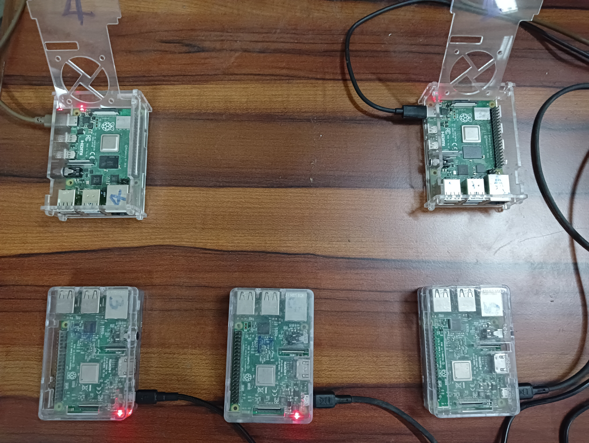
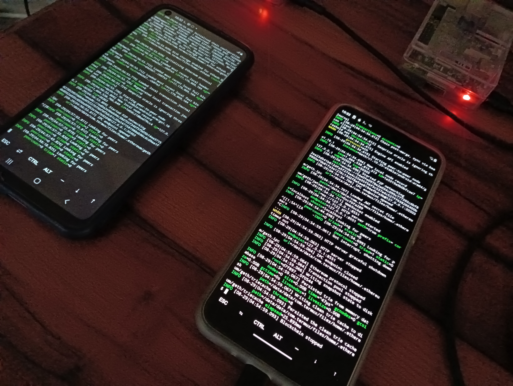
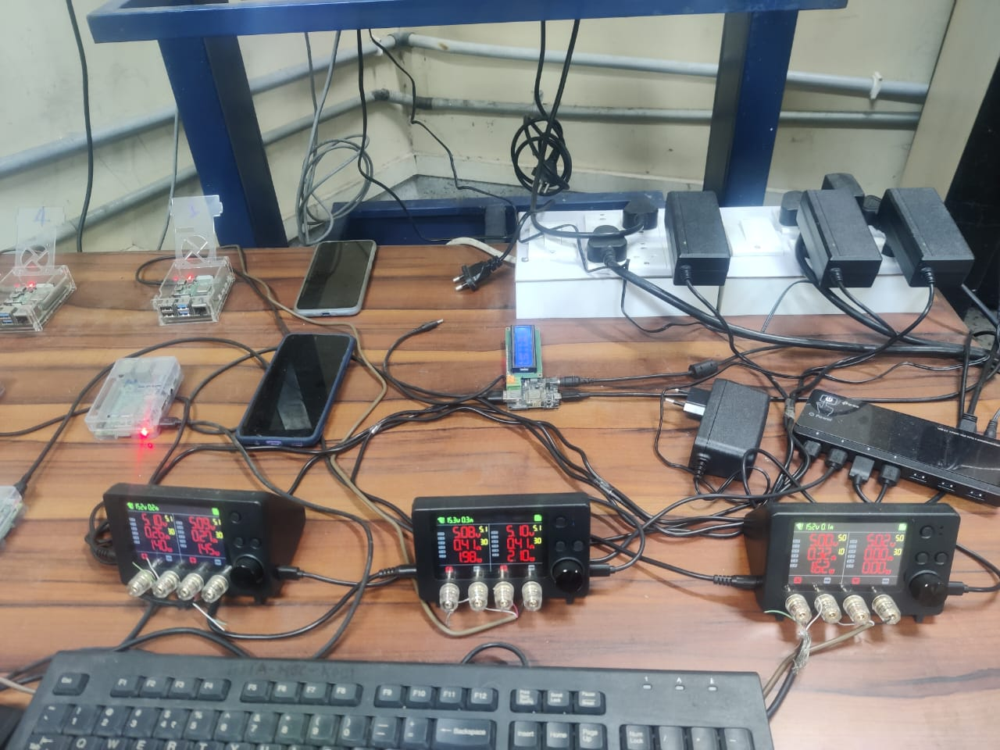
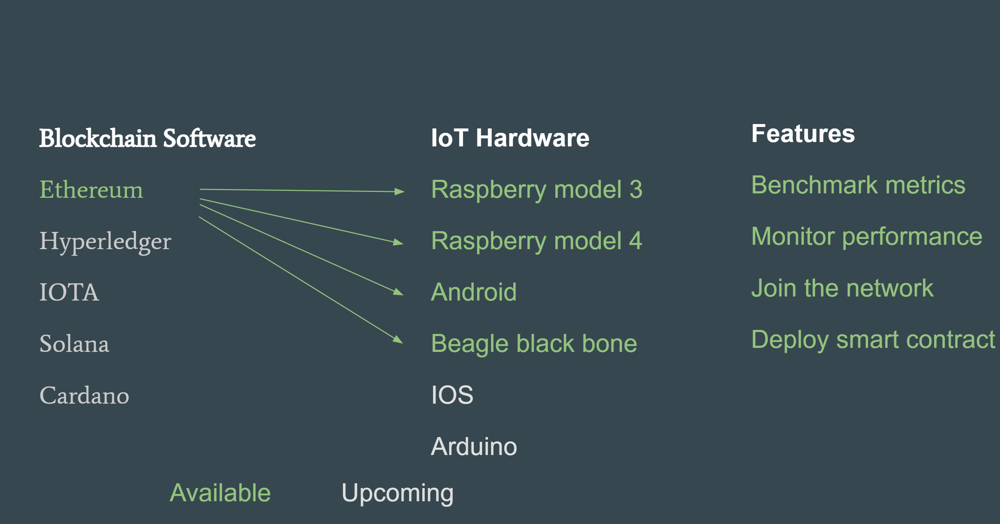
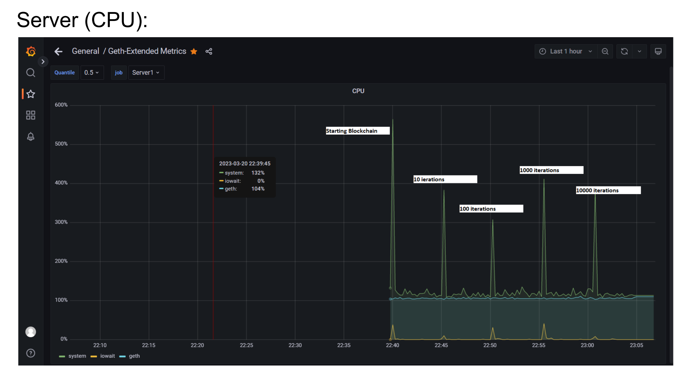
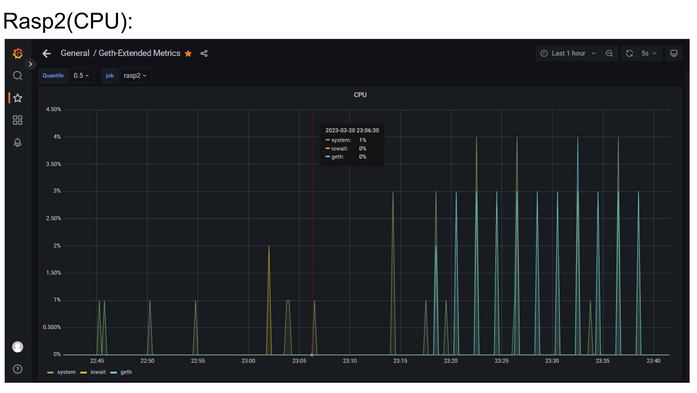
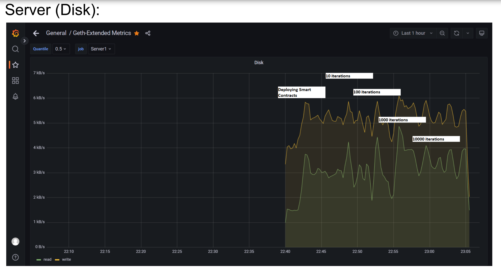
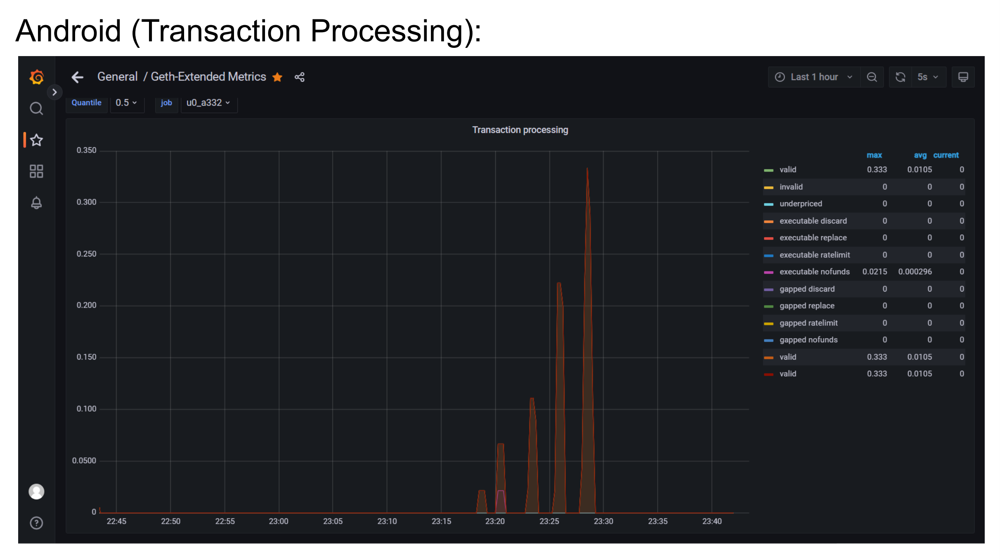

# BlockPAAS: Blockchain Platform as a Service

**BlockPAAS** is an innovative platform-as-a-service designed to simplify blockchain integration and testing on IoT hardware. It allows users to create and manage networks of blockchain nodes running on selected IoT devices, such as Raspberry Pi and Android devices. With BlockPAAS, developers and researchers can explore blockchain protocols in real-world resource-constrained environments, ensuring scalability, efficiency, and performance.

## Key Features
- **Custom Blockchain Networks**: Users can create private networks of blockchain nodes using their chosen IoT devices.
- **Protocol Flexibility**: Select from supported blockchain protocols to run on the hardware (currently supports Ethereum).
- **Smart Contract Deployment**: Deploy smart contracts directly to the platform's blockchain nodes using [Remix IDE](https://remix.ethereum.org) via an HTTP endpoint provided by the platform.
- **Performance Benchmarking**: Analyze and optimize the performance of deployed smart contracts on IoT devices by monitoring:
  - **System Metrics**: RAM usage, CPU utilization, and power consumption.
  - **Blockchain Metrics**: Block size, number of transactions, and hundreds of other real-time blockchain-specific parameters.
- **Real-Time Monitoring**: Integrated with tools like Prometheus and Grafana, BlockPAAS offers live visual dashboards for detailed performance insights.

## Why BlockPAAS?
Existing blockchain platforms often run in virtual environments that do not accurately reflect the constraints of IoT devices. BlockPAAS bridges this gap by enabling users to test and optimize blockchain protocols and smart contracts on real hardware, providing reliable metrics for practical applications in IoT and edge computing.

## Current Protocol Support
- **Ethereum**: Fully supported, allowing seamless smart contract deployment and interaction via Remix IDE.

*Future Protocols*: We are actively working to expand support for additional protocols such as Hyperledger and IOTA.

## Learn More
For detailed information about the architecture, implementation, and use cases of BlockPAAS, refer to our publication in [COMSNETS 2023](https://ieeexplore.ieee.org/abstract/document/10041392/).

BlockPAAS is a platform as a service on which end users can create a network of blockchain nodes running in selected IoT hardware. Users can choose a blockchain protocol to run on the hardware. The selected devices form a network. End users can deploy smart contracts via Remix onto the platform blockchain nodes and benchmark the performance. The platform also offers various live metrics like RAM, CPU, Power and hundreds of other blockchain metrics.
Ethereum platform is supported for now. Refer to the paper [COMSNETS](https://ieeexplore.ieee.org/abstract/document/10041392/) for more details. 

<!-- Users can avail the services of the Platform at [https://nsclab.iiita.ac.in](https://nsclab.iiita.ac.in) -->

    <td></td>
    <td></td>
    <td></td>

Please take a look at the [video](https://www.youtube.com/watch?v=ZpR_Q2gdJvA&t) for the demo.

## Current State of the Platform

## Results

    
    

    
    

